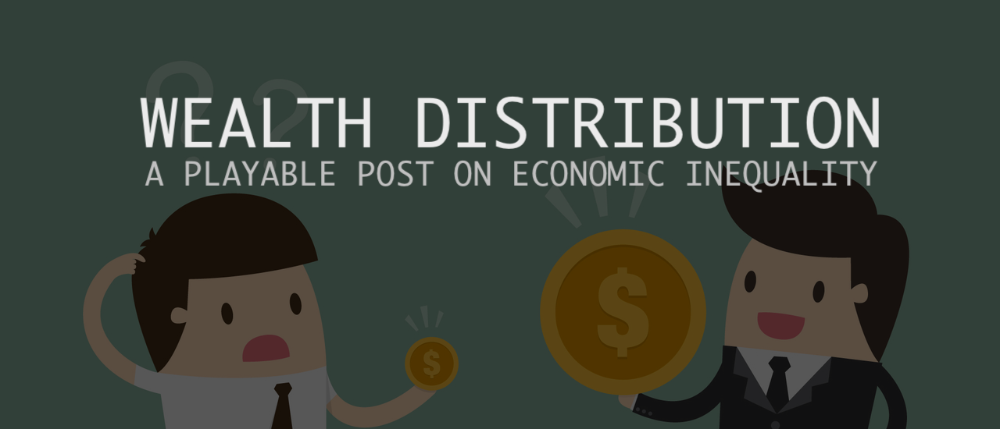

**[PLAY IT HERE (https://jlliao.github.io/equality/)](https://jlliao.github.io/equality/)**

---

This playable post is a story of how economic inequality takes place and how we can diminish it.
The models are developed using [Netlogo](https://ccl.northwestern.edu/netlogo/).
			
Please feel free to use this in your classrooms,
make video/picture/text adaptations,
or modify the source code!
Attribution is not mandatory, but super appreciated.
We are [Jianglong Liao](https://jlliao.com/) and Stinson Shi. 
